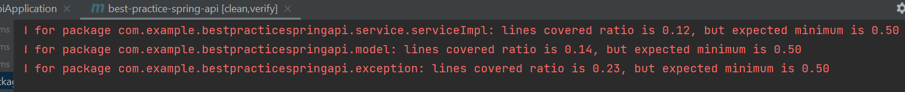
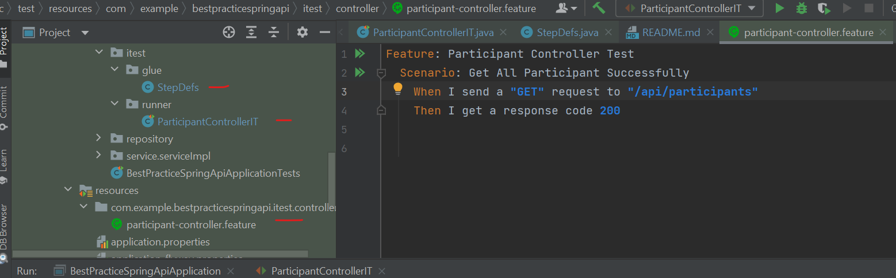
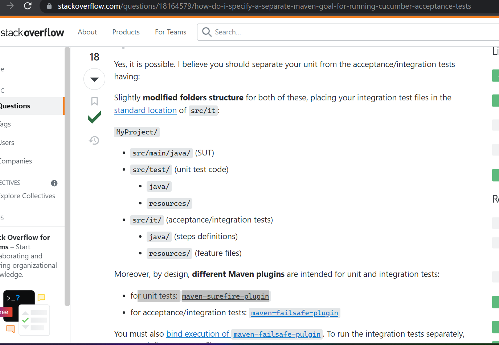
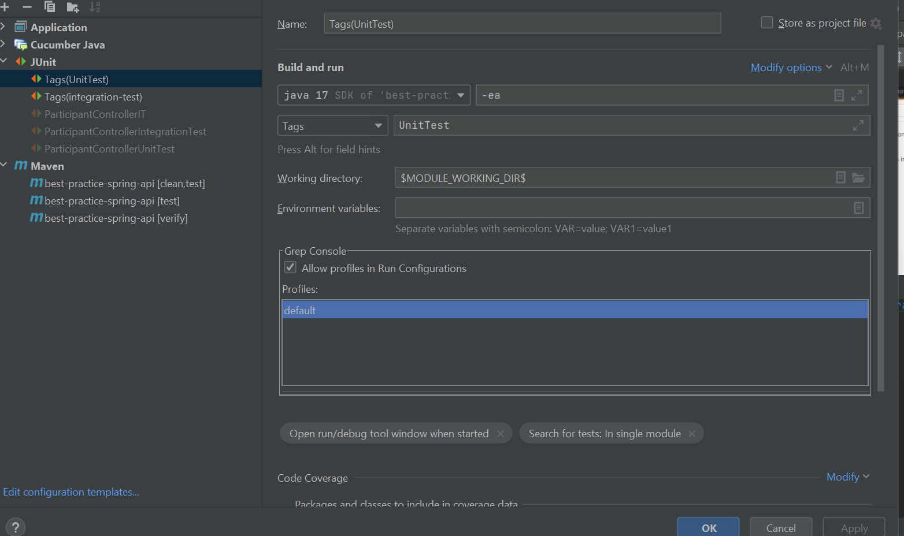
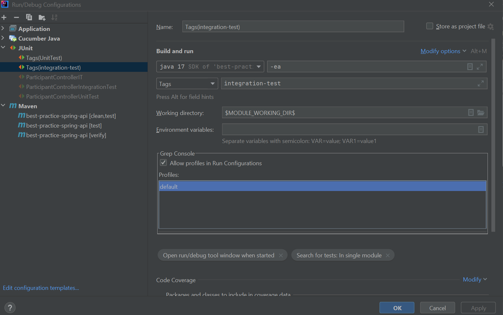
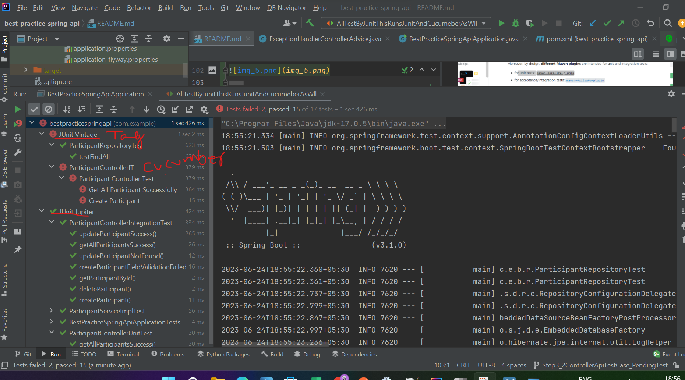

# best-practice-spring-api

#### Step 1 : best practice : Completed : DTO
#### Step 2 : best practice : TOBE : Spring Boot Exception handling with Controller Advice
    Issue: GET: localhost:8080/api/participants/5
    When Resource does not exist It throws error
        {
            "timestamp": "2023-06-17T16:47:38.448+00:00",
            "status": 500,
            "error": "Internal Server Error",
            "trace": "com.example.bestpracticespringapi.exception.ResourceNotFoundException: Participant id 5\r\n\tat com.example.bestpracticespringapi.service.serviceImpl.ParticipantServiceImpl.getParticipantById(ParticipantServiceImpl.java:62)\r\n\tat com.example.bestpracticespringapi.controller.ParticipantController.getParticipantById(ParticipantController.java:41)\r\n\tat java.base/jdk.internal.reflect.NativeMethodAccessorImpl.invoke0(Native Method)\r\n\tat java.base/jdk.internal.reflect.NativeMethodAccessorImpl.invoke(NativeMethodAccessorImpl.java:77)\r\n\tat java.base/jdk.internal.reflect.DelegatingMethodAccessorImpl.invoke(DelegatingMethodAccessorImpl.java:43)\r\n\tat java.base/java.lang.reflect.Method.invoke(Method.java:568)\r\n\tat org.springframework.web.method.support.InvocableHandlerMethod.doInvoke(InvocableHandlerMethod.java:207)\r\n\tat org.springframework.web.method.support.InvocableHandlerMethod.invokeForRequest(InvocableHandlerMethod.java:152)\r\n\tat org.springframework.web.servlet.mvc.method.annotation.ServletInvocableHandlerMethod.invokeAndHandle(ServletInvocableHandlerMethod.java:118)\r\n\tat org.springframework.web.servlet.mvc.method.annotation.RequestMappingHandlerAdapter.invokeHandlerMethod(RequestMappingHandlerAdapter.java:884)\r\n\tat org.springframework.web.servlet.mvc.method.annotation.RequestMappingHandlerAdapter.handleInternal(RequestMappingHandlerAdapter.java:797)\r\n\tat org.springframework.web.servlet.mvc.method.AbstractHandlerMethodAdapter.handle(AbstractHandlerMethodAdapter.java:87)\r\n\tat org.springframework.web.servlet.DispatcherServlet.doDispatch(DispatcherServlet.java:1081)\r\n\tat org.springframework.web.servlet.DispatcherServlet.doService(DispatcherServlet.java:974)\r\n\tat org.springframework.web.servlet.FrameworkServlet.processRequest(FrameworkServlet.java:1011)\r\n\tat org.springframework.web.servlet.FrameworkServlet.doGet(FrameworkServlet.java:903)\r\n\tat jakarta.servlet.http.HttpServlet.service(HttpServlet.java:564)\r\n\tat org.springframework.web.servlet.FrameworkServlet.service(FrameworkServlet.java:885)\r\n\tat jakarta.servlet.http.HttpServlet.service(HttpServlet.java:658)\r\n\tat org.apache.catalina.core.ApplicationFilterChain.internalDoFilter(ApplicationFilterChain.java:205)\r\n\tat org.apache.catalina.core.ApplicationFilterChain.doFilter(ApplicationFilterChain.java:149)\r\n\tat org.apache.tomcat.websocket.server.WsFilter.doFilter(WsFilter.java:51)\r\n\tat org.apache.catalina.core.ApplicationFilterChain.internalDoFilter(ApplicationFilterChain.java:174)\r\n\tat org.apache.catalina.core.ApplicationFilterChain.doFilter(ApplicationFilterChain.java:149)\r\n\tat org.springframework.web.filter.RequestContextFilter.doFilterInternal(RequestContextFilter.java:100)\r\n\tat org.springframework.web.filter.OncePerRequestFilter.doFilter(OncePerRequestFilter.java:116)\r\n\tat org.apache.catalina.core.ApplicationFilterChain.internalDoFilter(ApplicationFilterChain.java:174)\r\n\tat org.apache.catalina.core.ApplicationFilterChain.doFilter(ApplicationFilterChain.java:149)\r\n\tat org.springframework.web.filter.FormContentFilter.doFilterInternal(FormContentFilter.java:93)\r\n\tat org.springframework.web.filter.OncePerRequestFilter.doFilter(OncePerRequestFilter.java:116)\r\n\tat org.apache.catalina.core.ApplicationFilterChain.internalDoFilter(ApplicationFilterChain.java:174)\r\n\tat org.apache.catalina.core.ApplicationFilterChain.doFilter(ApplicationFilterChain.java:149)\r\n\tat org.springframework.web.filter.CharacterEncodingFilter.doFilterInternal(CharacterEncodingFilter.java:201)\r\n\tat org.springframework.web.filter.OncePerRequestFilter.doFilter(OncePerRequestFilter.java:116)\r\n\tat org.apache.catalina.core.ApplicationFilterChain.internalDoFilter(ApplicationFilterChain.java:174)\r\n\tat org.apache.catalina.core.ApplicationFilterChain.doFilter(ApplicationFilterChain.java:149)\r\n\tat org.apache.catalina.core.StandardWrapperValve.invoke(StandardWrapperValve.java:166)\r\n\tat org.apache.catalina.core.StandardContextValve.invoke(StandardContextValve.java:90)\r\n\tat org.apache.catalina.authenticator.AuthenticatorBase.invoke(AuthenticatorBase.java:482)\r\n\tat org.apache.catalina.core.StandardHostValve.invoke(StandardHostValve.java:115)\r\n\tat org.apache.catalina.valves.ErrorReportValve.invoke(ErrorReportValve.java:93)\r\n\tat org.apache.catalina.core.StandardEngineValve.invoke(StandardEngineValve.java:74)\r\n\tat org.apache.catalina.connector.CoyoteAdapter.service(CoyoteAdapter.java:341)\r\n\tat org.apache.coyote.http11.Http11Processor.service(Http11Processor.java:390)\r\n\tat org.apache.coyote.AbstractProcessorLight.process(AbstractProcessorLight.java:63)\r\n\tat org.apache.coyote.AbstractProtocol$ConnectionHandler.process(AbstractProtocol.java:894)\r\n\tat org.apache.tomcat.util.net.NioEndpoint$SocketProcessor.doRun(NioEndpoint.java:1741)\r\n\tat org.apache.tomcat.util.net.SocketProcessorBase.run(SocketProcessorBase.java:52)\r\n\tat org.apache.tomcat.util.threads.ThreadPoolExecutor.runWorker(ThreadPoolExecutor.java:1191)\r\n\tat org.apache.tomcat.util.threads.ThreadPoolExecutor$Worker.run(ThreadPoolExecutor.java:659)\r\n\tat org.apache.tomcat.util.threads.TaskThread$WrappingRunnable.run(TaskThread.java:61)\r\n\tat java.base/java.lang.Thread.run(Thread.java:833)\r\n",
            "message": "Participant id 5",
            "path": "/api/participants/5"
        }
    
    Issue: PUT: Exception_NoResource: localhost:8080/api/participants/10
    When PUT gives bad request, Resource does not exist It throws error
        {
            "timestamp": "2023-06-17T16:02:06.687+00:00",
            "status": 400,
            "error": "Bad Request",
            "trace": "org.springframework.http.converter.HttpMessageNotReadableException: Required request body is missing: public org.springframework.http.ResponseEntity<com.example.bestpracticespringapi.dto.ParticipantDto> com.example.bestpracticespringapi.controller.ParticipantController.updateParticipant(long,com.example.bestpracticespringapi.dto.ParticipantDto) throws com.example.bestpracticespringapi.exception.ResourceNotFoundException\r\n\tat org.springframework.web.servlet.mvc.method.annotation.RequestResponseBodyMethodProcessor.readWithMessageConverters(RequestResponseBodyMethodProcessor.java:166)\r\n\tat org.springframework.web.servlet.mvc.method.annotation.RequestResponseBodyMethodProcessor.resolveArgument(RequestResponseBodyMethodProcessor.java:136)\r\n\tat org.springframework.web.method.support.HandlerMethodArgumentResolverComposite.resolveArgument(HandlerMethodArgumentResolverComposite.java:122)\r\n\tat org.springframework.web.method.support.InvocableHandlerMethod.getMethodArgumentValues(InvocableHandlerMethod.java:181)\r\n\tat org.springframework.web.method.support.InvocableHandlerMethod.invokeForRequest(InvocableHandlerMethod.java:148)\r\n\tat org.springframework.web.servlet.mvc.method.annotation.ServletInvocableHandlerMethod.invokeAndHandle(ServletInvocableHandlerMethod.java:118)\r\n\tat org.springframework.web.servlet.mvc.method.annotation.RequestMappingHandlerAdapter.invokeHandlerMethod(RequestMappingHandlerAdapter.java:884)\r\n\tat org.springframework.web.servlet.mvc.method.annotation.RequestMappingHandlerAdapter.handleInternal(RequestMappingHandlerAdapter.java:797)\r\n\tat org.springframework.web.servlet.mvc.method.AbstractHandlerMethodAdapter.handle(AbstractHandlerMethodAdapter.java:87)\r\n\tat org.springframework.web.servlet.DispatcherServlet.doDispatch(DispatcherServlet.java:1081)\r\n\tat org.springframework.web.servlet.DispatcherServlet.doService(DispatcherServlet.java:974)\r\n\tat org.springframework.web.servlet.FrameworkServlet.processRequest(FrameworkServlet.java:1011)\r\n\tat org.springframework.web.servlet.FrameworkServlet.doPut(FrameworkServlet.java:925)\r\n\tat jakarta.servlet.http.HttpServlet.service(HttpServlet.java:593)\r\n\tat org.springframework.web.servlet.FrameworkServlet.service(FrameworkServlet.java:885)\r\n\tat jakarta.servlet.http.HttpServlet.service(HttpServlet.java:658)\r\n\tat org.apache.catalina.core.ApplicationFilterChain.internalDoFilter(ApplicationFilterChain.java:205)\r\n\tat org.apache.catalina.core.ApplicationFilterChain.doFilter(ApplicationFilterChain.java:149)\r\n\tat org.apache.tomcat.websocket.server.WsFilter.doFilter(WsFilter.java:51)\r\n\tat org.apache.catalina.core.ApplicationFilterChain.internalDoFilter(ApplicationFilterChain.java:174)\r\n\tat org.apache.catalina.core.ApplicationFilterChain.doFilter(ApplicationFilterChain.java:149)\r\n\tat org.springframework.web.filter.RequestContextFilter.doFilterInternal(RequestContextFilter.java:100)\r\n\tat org.springframework.web.filter.OncePerRequestFilter.doFilter(OncePerRequestFilter.java:116)\r\n\tat org.apache.catalina.core.ApplicationFilterChain.internalDoFilter(ApplicationFilterChain.java:174)\r\n\tat org.apache.catalina.core.ApplicationFilterChain.doFilter(ApplicationFilterChain.java:149)\r\n\tat org.springframework.web.filter.FormContentFilter.doFilterInternal(FormContentFilter.java:93)\r\n\tat org.springframework.web.filter.OncePerRequestFilter.doFilter(OncePerRequestFilter.java:116)\r\n\tat org.apache.catalina.core.ApplicationFilterChain.internalDoFilter(ApplicationFilterChain.java:174)\r\n\tat org.apache.catalina.core.ApplicationFilterChain.doFilter(ApplicationFilterChain.java:149)\r\n\tat org.springframework.web.filter.CharacterEncodingFilter.doFilterInternal(CharacterEncodingFilter.java:201)\r\n\tat org.springframework.web.filter.OncePerRequestFilter.doFilter(OncePerRequestFilter.java:116)\r\n\tat org.apache.catalina.core.ApplicationFilterChain.internalDoFilter(ApplicationFilterChain.java:174)\r\n\tat org.apache.catalina.core.ApplicationFilterChain.doFilter(ApplicationFilterChain.java:149)\r\n\tat org.apache.catalina.core.StandardWrapperValve.invoke(StandardWrapperValve.java:166)\r\n\tat org.apache.catalina.core.StandardContextValve.invoke(StandardContextValve.java:90)\r\n\tat org.apache.catalina.authenticator.AuthenticatorBase.invoke(AuthenticatorBase.java:482)\r\n\tat org.apache.catalina.core.StandardHostValve.invoke(StandardHostValve.java:115)\r\n\tat org.apache.catalina.valves.ErrorReportValve.invoke(ErrorReportValve.java:93)\r\n\tat org.apache.catalina.core.StandardEngineValve.invoke(StandardEngineValve.java:74)\r\n\tat org.apache.catalina.connector.CoyoteAdapter.service(CoyoteAdapter.java:341)\r\n\tat org.apache.coyote.http11.Http11Processor.service(Http11Processor.java:390)\r\n\tat org.apache.coyote.AbstractProcessorLight.process(AbstractProcessorLight.java:63)\r\n\tat org.apache.coyote.AbstractProtocol$ConnectionHandler.process(AbstractProtocol.java:894)\r\n\tat org.apache.tomcat.util.net.NioEndpoint$SocketProcessor.doRun(NioEndpoint.java:1741)\r\n\tat org.apache.tomcat.util.net.SocketProcessorBase.run(SocketProcessorBase.java:52)\r\n\tat org.apache.tomcat.util.threads.ThreadPoolExecutor.runWorker(ThreadPoolExecutor.java:1191)\r\n\tat org.apache.tomcat.util.threads.ThreadPoolExecutor$Worker.run(ThreadPoolExecutor.java:659)\r\n\tat org.apache.tomcat.util.threads.TaskThread$WrappingRunnable.run(TaskThread.java:61)\r\n\tat java.base/java.lang.Thread.run(Thread.java:833)\r\n",
            "message": "Required request body is missing: public org.springframework.http.ResponseEntity<com.example.bestpracticespringapi.dto.ParticipantDto> com.example.bestpracticespringapi.controller.ParticipantController.updateParticipant(long,com.example.bestpracticespringapi.dto.ParticipantDto) throws com.example.bestpracticespringapi.exception.ResourceNotFoundException",
            "path": "/api/participants/10"
        }

Out put from Postman For Valid
Handling Exception via Controller Advice

Service gave NoResource Found to Controller
and Controller Handled Exception with Controller Advice

Controller gave API Response for All get call

#### Step 3 : best practice : Test Coverage JACOCO
https://www.lambdatest.com/blog/reporting-code-coverage-using-maven-and-jacoco-plugin/

Coverage Before

https://www.baeldung.com/spring-boot-bean-validation
https://reflectoring.io/spring-boot-web-controller-test/

Coverage After 3 controller method test implementation, 

Run Code Insect Code_31Warnings__Before

After Some Cleanup

#### Step 3_2 : best practice : Test Coverage Pending
clean verify : to check code rules set in jacoco:check goal are met or not.

Selenium provides better
    browser coverage
    Parallel testing

https://reflectoring.io/spring-boot-web-controller-test/

Tags for Integration Test and Unit Test
https://medium.com/edataconsulting/how-to-add-integration-tests-to-our-spring-boot-backend-8ab00313b6ad

    To run our tests, we can execute any of these commands: mvn verify, mvn install, or mvn deploy.
    With Spring Boot 1.4, things should get simpler. There is a single @SpringBootTest annotation to use for regular tests

Cucumber Integration test
This needs runing system use for E2E
https://www.baeldung.com/cucumber-spring-integration
With cucumber report under target/cucumber-report.html

Separate Unit Test with Cucumber Integration Test TOBE

https://stackoverflow.com/questions/18164579/how-do-i-specify-a-separate-maven-goal-for-running-cucumber-acceptance-tests
http://www.weblogism.com/item/334/integration-tests-with-cucumber-jvm-selenium-and-maven

Run JUNIT Test separately for different type
like UnitTest, IntegrationTest
Solution1 : @Tag(UnitTest)

Solution2: Create custom annotation e.g. @IntegrationTest

Run all Test from Junit
This runs all test Unit, Integration, Cucumber etc

